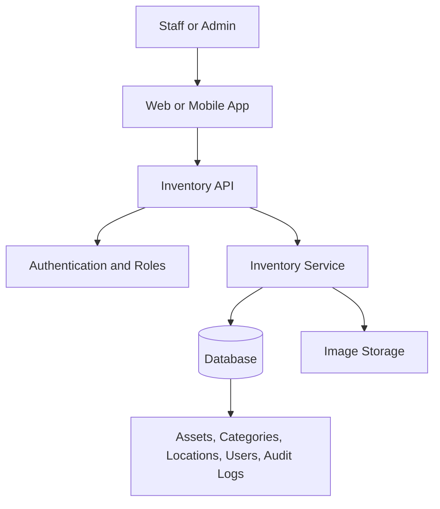

# Architecture

## Overview

Inventory Ops Professional is a responsive inventory and asset-management application. It begins with a focused CRUD workflow and can grow to include image storage, barcode/UPC scanning, roles, and maintenance history.

## Core entities

- **Asset** — internal asset ID, name, category, quantity, condition, status, location, optional image, and optional barcode/UPC.
- **Category** — a grouping such as Equipment or Storage.
- **Location** — the asset's current storage or work location.
- **User** — an authenticated staff member or administrator.
- **Audit log** — a timestamped record of asset changes and the user who made them.

## CRUD rules

- **Create:** authorized users add an asset and optionally attach an image.
- **Read:** staff search, filter, and view asset details.
- **Update:** authorized users adjust quantity, condition, status, or location.
- **Archive:** assets are archived rather than permanently deleted to preserve history.

## Technology direction

The application will use a React-based responsive front end. The API, database, authentication provider, and image storage service will be selected before the data-backed milestone.
