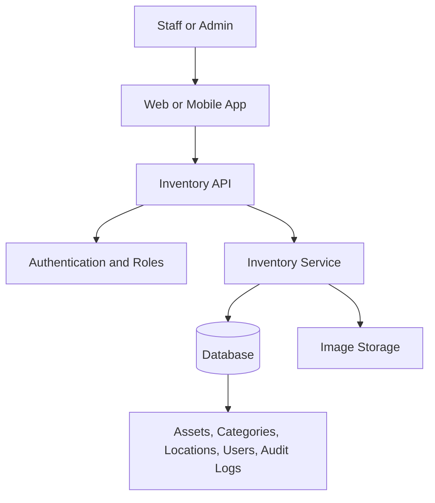

# Architecture

## Overview

Inventory Ops Professional is a responsive inventory and asset-management application. It begins with a focused CRUD workflow and can grow to include image storage, barcode/UPC scanning, roles, and maintenance history.

## Core entities

- **Asset** — internal asset ID, name, category, quantity, condition, status, location, optional image, and optional barcode/UPC.
- **Category** — a grouping such as Equipment or Storage.
- **Location** — the asset's current storage or work location.
- **User** — an authenticated staff member or administrator.
- **Audit log** — a timestamped record of asset changes and the user who made them.

## CRUD rules

- **Create:** authorized users add an asset and optionally attach an image.
- **Read:** staff search, filter, and view asset details.
- **Update:** authorized users adjust quantity, condition, status, or location.
- **Archive:** assets are archived rather than permanently deleted to preserve history.

## Phase 7 backend foundation

- **API:** Express REST API with `/api/auth`, `/api/assets`, and `/api/audit-events` endpoints.
- **Database:** SQLite for a zero-setup local data foundation. Assets, users, and audit events are separate records; PostgreSQL can replace SQLite at deployment without changing the API contract.
- **Authentication:** bcrypt password hashes and signed JWT sessions. Staff can create/update assets; only administrators can archive records.
- **Integrity:** The native asset ID remains the primary key. An optional barcode/UPC is a separate, unique lookup value, never the record’s identity.

## Technology direction

The React front end is ready to be connected to the Express API. Image storage is intentionally deferred until a hosted storage provider is selected.
